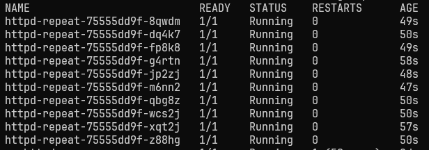

What we will cover in this project

- Setting up a cluster on your local machine
- Setting up a basic CLI based workflow using tmux, vim and k9s, which is also compatible with VSCode or other tools
- What is Kubernetes and what is it used for
- Basic structure of a Kubernetes cluster
- Fundamentals of Kubernetes applications: pods, deployments
- Kubernetes Manifests: It's all just yaml
- Fundamentals of Kubernetes Storage: persistent volumes, pvc, storage provider
- Fundamentals of Kubernetes networking: service, loadbalancer and ingress
- Kubernetes troubleshooting and where to look for issues
- Installing applications with Helm
- Setting up a basic monitoring stack

# Windows Setup
To run our kubernetes on windows we'll be using [Rancher Desktop](https://rancherdesktop.io/). Make sure WSL is installed on your machine.
And in Rancher settings make sure Rancher is connected to the WSL you are going to be using with your kubernetes cluster.


# Linux Setup
https://docs.rancherdesktop.io/getting-started/installation/#linux
## Optional required packages
### apt/brew:
- tmux
- vim or nvim
- bash-completion (for Linux/WSL)
### brew:
- kubectl
- k9s
### .bashrc
Set up .bashrc for kubectl completion by adding the following:
```
alias k='kubectl'
source /etc/bash_completion # not needed on macos
source <(kubectl completion bash)
complete -o default -F __start_kubectl k
```
### .vimrc
This is a basic .vimrc for YAML editing:
```
" Ensure Vim uses filetype plugins
filetype plugin on

" Enable indentation
filetype indent on

" Set the default indentation to 2 spaces for all files
set tabstop=2
set softtabstop=2
set shiftwidth=2
set expandtab

" Highlight trailing whitespace in all files
autocmd BufRead,BufNewFile * match Error /\s\+$/

" Enable auto-indentation
set autoindent

" Turn on syntax highlighting
syntax on

" Set backspace so it acts more intuitively
set backspace=indent,eol,start
```

After Rancher is done you should see at the bottom of the Rancher windows following:
```
Version: 1.17.1    Network status: online    Kubernetes: 1.31.5    CE: moby
```

Now let's try to connect to our kubernetes cluster. `
Run:
```
kubectl get pods -A
```
Output:
```
NAMESPACE     NAME                                      READY   STATUS      RESTARTS      AGE
kube-system   coredns-ccb96694c-4bx27                   1/1     Running     2 (35m ago)   11d
kube-system   helm-install-traefik-crd-47mnw            0/1     Completed   0             11d
kube-system   helm-install-traefik-xkdd5                0/1     Completed   1             11d
kube-system   local-path-provisioner-5cf85fd84d-pvq5j   1/1     Running     2 (35m ago)   11d
kube-system   metrics-server-5985cbc9d7-zjxdc           1/1     Running     2 (35m ago)   11d
kube-system   svclb-traefik-994b44dd-hzj57              2/2     Running     4 (35m ago)   11d
kube-system   traefik-5d45fc8cc9-zsd9z                  1/1     Running     2 (35m ago)   11d
````

Also install [k9s](https://k9scli.io/topics/install/) a CLI to manage your clusters in style. Run `k9s` in your console and press `0` to display all pods on your system.


To bail out of k9s press `ctrl-c`.

Let's run our first pod:
```
kubectl run nginx --image=nginx
```
Output:
```
pod/nginx created
```
With `kubectl get pod` we should see our new created pod running:
```
NAME    READY   STATUS    RESTARTS   AGE
nginx   1/1     Running   0          61s
```
Let's also get another pod running, the image in this case is `httpd`.
A pod is a group of containers and other resources.

Let's describe our `nginx` pod:
```
kubectl describe pod nginx
```
Ouput:
```
kubectl describe pod nginx
```

```
Name:             nginx
Namespace:        default
Priority:         0
Service Account:  default
.
.
.
Events:
Type    Reason     Age   From               Message
----    ------     ----  ----               -------
Normal  Scheduled  19m   default-scheduler  Successfully assigned default/nginx to desktop-6le8v2o
Normal  Pulling    19m   kubelet            Pulling image "nginx"
Normal  Pulled     19m   kubelet            Successfully pulled image "nginx" in 8.679s (8.679s including waiting). Image size: 191994076 bytes.
Normal  Created    19m   kubelet            Created container nginx
Normal  Started    19m   kubelet            Started container nginx
```

To get our pods IP adresses run:
```
kubectl get pods -o wide
```
Output:
```
NAME       READY   STATUS    RESTARTS   AGE   IP           NODE              NOMINATED NODE   READINESS GATES
my-httpd   1/1     Running   0          28m   10.42.0.25   desktop-6le8v2o   <none>           <none>
nginx      1/1     Running   0          33m   10.42.0.24   desktop-6le8v2o   <none>           <none>
```

To get the yaml object of our nginx pod, run:
```
kubectl get pod nginx -o yaml
```

To edit the yaml file of a pod, run:
```
kubectl edit pod <pod-name>
```

# Let's deploy a pod using yaml
Let's run
```
kubectl run nginx-yaml --image=nginx --dry-run=client -o yaml
```
Output:
```
apiVersion: v1
kind: Pod
metadata:
  creationTimestamp: null
  labels:
    run: nginx-yaml
  name: nginx-yaml
spec:
  containers:
  - image: nginx
    name: nginx-yaml
    resources: {}
  dnsPolicy: ClusterFirst
  restartPolicy: Always
status: {}
```
Let's rerun and redirect the output to a file and then make some adjustment:
```
kubectl run nginx-yaml --image=nginx --dry-run=client -o yaml > nginx.yaml
```
nginx.yaml:
```
apiVersion: v1
kind: Pod
metadata:
  labels:
    run: nginx
    method: fromcode
  name: nginx-yaml
spec:
  containers:
  - image: nginx
    name: nginx

```
Let's deploy the new pod to our cluster using the yaml file:
```
kubectl apply -f nginx.yaml
```
Output:
```
pod/nginx-yaml created
```
With `kubectl get pods` we should see the new pod `nginx-yaml` ist up and running.

To delete a pod run:
```
kubectl delete pod <pod-name>
```

To interact with a pod, run:
```
kubectl exec -it <pod-name> -- /bin/<bash|sh> 
```

# Deployments
## Deployment
### RollingUpdate Strategy
Let's deploy for instance 10 pods
```
k create deploy --image=http --replicas=10 --dry-run=client -o yaml > httpd.yaml
```
`httpd-recreate.yaml`
```
apiVersion: apps/v1
kind: Deployment
metadata:
  labels:
    app: httpd-repeat
  name: httpd-repeat
spec:
  replicas: 10
  selector:
    matchLabels:
      app: httpd-repeat
  template:
    metadata:
      labels:
        app: httpd-repeat
    spec:
      containers:
      - image: httpd:alpine3.19
        name: httpd
  strategy: 
    type: RollingUpdate
    rollingUpdate:
      maxUnavailable: 1
      maxSurge: 1
```
With the watch command we can see how the pods are being deployed:
```
watch -n 1 "kubectl get pods"
```
Now let's deploy:
```
k apply -f httpd.yaml
```
Now with `k get pods` we should all 11 pods running:



11 because ``strategy`` > ``rollingUpdate`` > ``maxSurge`` is set to ``1``.

### Recreate Strategy
`httpd-rollingUpdate.yaml`
```
apiVersion: apps/v1
kind: Deployment
metadata:
  labels:
    app: httpd-repeat
  name: httpd-repeat
spec:
  replicas: 10
  selector:
    matchLabels:
      app: httpd-repeat
  template:
    metadata:
      labels:
        app: httpd-repeat
    spec:
      containers:
      - image: httpd:alpine3.19
        name: httpd
  strategy: 
    type: Recreate

```
To delete a deployment, run:
```
k delete deployment <deployment-name>
```
To delete pod, run:
```
k delete pod <pod-name>
```

## Namespaces
## Mealie